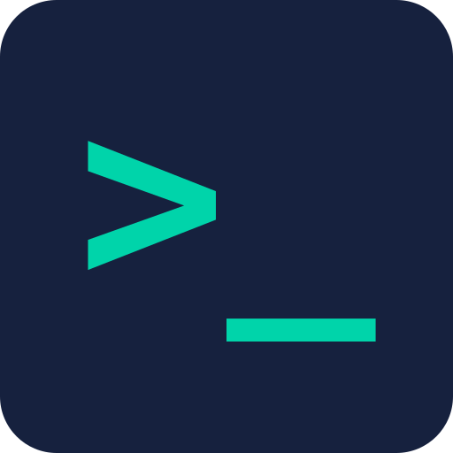

<p align="center">
  
</p>

<h1 align="center">Web Terminal</h1>

<p align="center">
  <b>Your AI coding agents, running on your Windows machine — reachable from any browser or your phone.</b>
</p>

<p align="center">
  
  
  
</p>

---

Start a Claude Code session on your desktop, walk away, and approve its next step from your
phone. Web Terminal keeps the shells alive on the host and gives you a real terminal —
plus a readable chat view of what the agent is actually doing — from anywhere on your
private network.

```bash
git clone https://github.com/Adiel-Sharabi/web-terminal.git
cd web-terminal && npm install && npm start
```

Open **http://localhost:7681** — default login `admin` / `admin`, which it makes you change.
Full instructions: **[docs/INSTALL.md](docs/INSTALL.md)**.

## Why

- **It doesn't stop when you close the tab.** A dedicated worker process owns every PTY, so
  sessions survive server restarts, browser reloads and network drops — with scrollback intact.
- **You find out when it needs you.** Permission prompts raise an urgent alert and can push
  to your phone even with the app closed. No more discovering a blocked agent an hour later.
- **It reads like a conversation, not a screen scrape.** The companion app renders the
  agent's transcript as chat, with proper cards for shell commands, file edits and subagents.
- **It waits out the 5-hour cap for you.** When an agent hits its usage limit it blocks on a
  question ("stop and wait, or upgrade?"). The worker answers *wait*, the row shows when the
  window reopens, and the session picks itself back up a minute after it does — so a limit
  hit overnight costs you the window, not the morning. Only sessions actually observed to be
  capped are resumed, and any row's badge turns it off for that session.
- **One sidebar, every machine.** Run it on several boxes and drive them all from one list.
- **Private by construction.** It binds to localhost; you reach it over your own VPN. Push
  notifications are content-free wake-ups — the text is fetched from your server, not a relay.

## Agent support — read this before choosing

| | Claude Code | Codex |
|---|:---:|:---:|
| Sessions, terminal, chat view, task list, usage badges | ✅ | ✅ |
| Status: waiting / idle | ✅ | ✅ |
| Status: **working** | ✅ | ❌ |
| Subagent drill-in · background-work badge · compaction indicator | ✅ | ❌ |

**Claude Code is fully supported. Codex support is partial and honest about it** — sessions
run and are genuinely usable, but Codex's hooks do not execute (measured, not assumed), so
status rides a narrower channel that has no turn-start signal. A Codex session can never
show *working*. Details and the reasoning: **[docs/AI-AGENTS.md](docs/AI-AGENTS.md)**.

Any other CLI runs fine as a plain shell — it just gets no agent-specific features.

## Highlights

**Sessions** — multiple terminals, instant switching, persistence across restarts, lazy
scrollback, drag-to-reorder, server-side favourites shared by every client, and a one-click
recap answering *"where was I in this one?"*

**Agent integration** — live status dots, task-list panel, rich tool cards, subagent
drill-in, context-window and rate-limit badges, background-work indicator, and read-aloud
that filters out the parts nobody wants spoken.

**Mobile & PWA** — installable, with a compose bar built for soft keyboards, a touch
toolbar, long-press menus, and reconnect the instant you return to the app.

**Cluster** — merge several servers into one sidebar, each showing its own CPU and
**free memory** so you can pick where to work; optional direct-terminal mode skips the
proxy hop for a large latency win.

**Headroom, not percentages** — the memory readout leads with the room actually left
(*"12.7G free of 31.7G"*), keeping the percentage as context, and colours on the
absolute figure. A percentage saturates exactly where the choice matters: 92% and 98%
are six points apart while the room underneath goes 2.5 GB to 0.65 GB — the difference
between a box that copes and one that is unusable. A server too old to report it falls
back to the percentage rather than showing a fabricated zero.

**Load view** — switch it on (the chart button in the web sidebar, the memory button in
the companion) and every server reports its **paging rate** (hard page reads per second,
the signal that tells 92%-and-coping apart from 92%-and-thrashing), what web-terminal
itself is costing there, and what each individual session is costing — so "which box,
which session" is answered from the list instead of by guessing. It is off by default
and polls nothing until switched on, because each reading costs the server a
whole-machine process query. The free-memory figure above is *not* behind this switch:
it costs nothing and is always reported.

**Companion app** — a native Android + Windows client with the chat lens and push that
works while the app is closed.

Full list: **[docs/FEATURES.md](docs/FEATURES.md)**.

## Documentation

| | |
|---|---|
| **[docs/INSTALL.md](docs/INSTALL.md)** | Install, auto-start, remote access, updating |
| **[docs/CONFIGURATION.md](docs/CONFIGURATION.md)** | Every setting and environment variable |
| **[docs/AI-AGENTS.md](docs/AI-AGENTS.md)** | Claude vs Codex support, hooks setup |
| **[docs/FEATURES.md](docs/FEATURES.md)** | The complete feature reference |
| **[docs/CLUSTER.md](docs/CLUSTER.md)** | Multi-server setup and direct terminal mode |
| **[docs/COMPANION.md](docs/COMPANION.md)** | The Android + Windows companion app |
| **[docs/TROUBLESHOOTING.md](docs/TROUBLESHOOTING.md)** | Known symptoms and dev tooling |
| **[docs/ARCHITECTURE.md](docs/ARCHITECTURE.md)** | How the three-process design works |
| **[AGENTS.md](AGENTS.md)** | Point an AI agent at this repo and it can install and operate it |
| **[CONTRIBUTING.md](CONTRIBUTING.md)** | Dev setup and the PR gate |
| **[SECURITY.md](SECURITY.md)** | Threat model and vulnerability reporting |

## How it works

Three supervised Node processes. `monitor.js` supervises the other two and restarts them on
crash. **`pty-worker.js` owns every PTY** — which is why killing the web layer costs you
nothing. `server.js` is stateless with respect to sessions and talks to the worker over an
authenticated local pipe.

```
Phone / Tablet ──┐
                 ├──> VPN ──> server.js ──(IPC)──> pty-worker.js ──> shell ──> agent
PC Browser ──────┘                │
                                  └──> other servers (cluster proxy)
```

That split is the reason a `server.js` restart keeps your sessions running — see
[docs/ARCHITECTURE.md](docs/ARCHITECTURE.md).

## Platform

**Windows-first by design**, where browser-based terminals are scarce. On Linux or macOS
you probably want [ttyd](https://github.com/tsl0922/ttyd),
[gotty](https://github.com/sorenisanerd/gotty) or
[code-server](https://github.com/coder/code-server) instead.

Requires [Node.js](https://nodejs.org) 18+ and [Git for Windows](https://git-scm.com/download/win).

## License

MIT — see [LICENSE](LICENSE).
